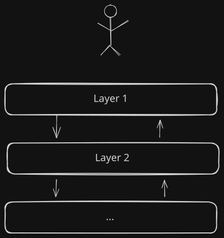
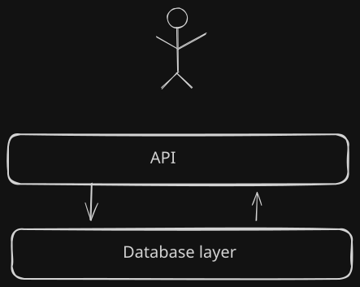

## Code Organization Workshop

Notes:
- Out of scope:
  - Linting and static analysis
  - DRY, KISS, YAGNI, SOLID, GoF patterns

---

## Application Layers

---

## Cohesion

A component's degree of focus.

---

## Outline

1. Structuring Code within a Module
1. Structuring Code across Modules <!-- .element: class="fragment" -->
1. Training Wheels are Off <!-- .element: class="fragment" -->
1. Summary <!-- .element: class="fragment" -->

---

## Part 1: Structuring Code within a Module

--

## Hands On

--

## Take a Break

--

## Recap

- We identified that it's hard to make the code change we want to do
- We wrote tests to avoid accidental breakage of our application <!-- .element: class="fragment" -->
- We refactored the code to make the database switch simpler <!-- .element: class="fragment" -->

Notes:
- In a way, automated tests and refactoring are was to derisk your project

--

## Take Aways

- Duplication makes code harder to change
- Automated tests give confidence when refactoring <!-- .element: class="fragment" -->
- Centralizing database operations made the code more testable <!-- .element: class="fragment" -->

--

## Tips

- There are often several levels of tests
- Don't refactor test code as hard as production code <!-- .element: class="fragment" -->
- The "Rule of Three" (Fowler et al. (1999))  is a good guideline for preventing code duplication <!-- .element: class="fragment" -->

Notes:

- Analogy between different levels of tests and a broken car

---

## Part 2: Structuring Code across Modules

--

## Hands On

--

## Take a Break

--

## Recap

- We introduced a new application layer

Notes:
- An application layer can have multiple modules or packages
- Each application layer usually has its own data model

--

## Take Aways

- Module imports can help identify modules with low cohesion
- Modules with high cohesion are easy to substitute <!-- .element: class="fragment" -->

--

## Tips

- Implement connections to external systems in separate modules
- Keep API surfaces as small as possible <!-- .element: class="fragment" -->

Notes:
- *API* in this case refers to general programming interfaces, not just to web APIs.
- Both points can be found in prolific software engineering literatur, such as Clean Architecture, Hexagonal Architecture, or DDD

---

## Part 3: Training Wheels are Off

--

## Hands On

---

## Summary

- Testing and refactoring are not an end in itself. Both serve a purpose.
- Be conscious about whether you're currently taking a shortcut or not <!-- .element: class="fragment" -->
- Make mistakes and learn from them <!-- .element: class="fragment" -->

---

## Feedback

---

## References

[Stevens at al. (1974). Structured design. IBM Systems Journal.](doi:10.1147/sj.132.0115)

Fowler et. al (1999). Refactoring: Improving the Design of Existing Code. Addison-Wesley Professional. ISBN 978-0201485677
